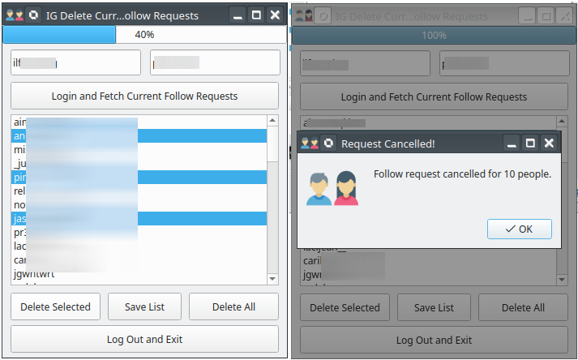
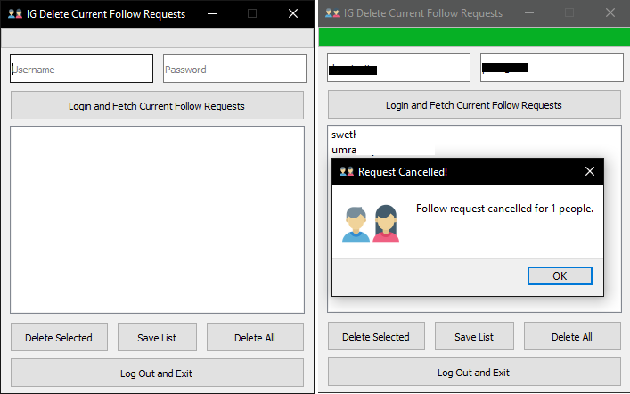

# FollowRequestsRemover

Remove sent follow requests on Instagram with this tool here. May not work while removing large number of requests, but can try by changing the sleep interval from 5 to 10 seconds or more.

**Created for learning and experimenting**. A lot of things need polishing and there is a lot of room for the improvement as well, so PRs are welcome.

## Getting started:

 1. Clone repo and cd: `git clone https://github.com/Suleman-Elahi/FollowRequestsRemover && cd FollowRequestsRemover`
 2. Install dependencies: `pip3 install pyqt5 requests`
 3. Run app: `python cfr.py`

Run it like this on any platform.

## Binary Releases:

Self-contained binary releases can be downloaded from the [Releases section](https://github.com/Suleman-Elahi/FollowRequestsRemover/releases). Just download and run them without installing Python or dependencies mentioned above.

Currently only Windows and Linux executables are there.

## Screenshots:

**Warning**: *Using Instagram like this may get your account banned, so proceed on your own risk*.

Icon credits: [iconscout](https://iconscout.com/icon/users-2955700)
